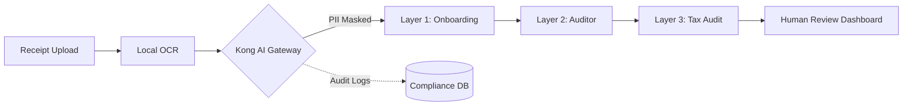

# 🛡️ ComplianceGuard: AI-Powered BPO Payroll Verifier

**Automated AI Compliance for BPO | Azets Hackathon 2026**

`ComplianceGuard` is a multi-layered, privacy-first AI orchestration system designed to automate payroll auditing while strictly adhering to the **EU AI Act** and **GDPR**. By leveraging the **Kong AI Gateway**, we ensure that sensitive PII never reaches a cloud LLM, providing a "Compliance-by-Design" solution for modern BPO workflows.

---

## 🚀 The Challenge
Business Process Outsourcing (BPO) firms handle millions of sensitive financial documents. With the arrival of the **EU AI Act**, using AI for payroll and tax classification is now deemed **"High-Risk."** **The Problem:** Traditional AI implementations often leak PII or lack the transparency required by law.
**The Solution:** A 3-layer Agentic workflow that uses Kong for redaction and generates granular audit trails for every decision.

---

## 🏗️ Multi-Layer Architecture

Our system splits the auditing process into three distinct cognitive layers, each with its own compliance constraints:

| Layer | Agent Persona | Responsibility | Compliance Focus |
| :--- | :--- | :--- | :--- |
| **Layer 1** | **The Guide** | Employee onboarding; receipt legibility & document integrity. | **Data Minimization (GDPR)** |
| **Layer 2** | **The Auditor** | Internal policy enforcement (e.g., meal limits, alcohol bans). | **Human-in-the-Loop (Art. 14)** |
| **Layer 3** | **The Tax Expert** | Final tax slab assignment & compliance log generation. | **Explainability (Art. 86)** |

---

## 🛡️ Kong AI Gateway Integration
We utilize **Kong AI Gateway** as our centralized governance layer. 

1.  **PII Sanitization:** All raw OCR text is routed through the `ai-pii-sanitizer` plugin. Names, IBANs, and addresses are masked *before* they reach the LLM.
2.  **Semantic Guardrails:** We use the `ai-semantic-guardrail` plugin to ensure agents stay strictly within the scope of payroll auditing, preventing prompt injections or off-topic queries.
3.  **Observability:** Every request is logged via Kong for a 100% immutable audit trail.

---

## ⚖️ EU AI Act Mapping
Our project is built to satisfy specific legal requirements:

* **Article 12 (Traceability):** Automatic generation of structured logs for every AI decision.
* **Article 14 (Human Oversight):** High-risk decisions (Tax Slab changes) require a manual "Human-in-the-Loop" approval.
* **Article 50 (Transparency):** Every user interaction includes a disclosure that they are engaging with an AI system.
* **Article 86 (Right to Explanation):** The system provides a plain-language `logic_explanation` for every flagged expense.

---

## 🛠️ Tech Stack
* **Gateway:** Kong AI Gateway / Kong Konnect
* **Backend:** Python 3.11 / FastAPI
* **AI Orchestration:** LangGraph (Agentic Workflow)
* **OCR:** EasyOCR / Tesseract
* **LLMs:** GPT-4o (accessed via Kong AI Gateway)
* **Redaction:** Kong `ai-pii-sanitizer`

---

## 🚦 Getting Started

### Prerequisites
* Kong Gateway installed with AI Plugins enabled.
* Python 3.10+
* OpenAI / Anthropic API Key (configured in Kong).

### Installation
1. **Clone the Repo:**
   ```bash
   git clone https://github.com/IamSupun/payroll-verifier.git
   cd payroll-verifier
   ```

2. **Configure Kong:**
   Enable the AI Proxy and PII Sanitizer on your route:
   ```bash
   curl -X POST http://localhost:8001/routes/ai-audit-route/plugins \
     --data "name=ai-pii-sanitizer" \
     --data "config.replacement_with=placeholder"
   ```

3. **Install Dependencies:**
   ```bash
   pip install -r requirements.txt
   ```

4. **Run the App:**
   ```bash
   uvicorn main:app --reload
   ```

---

## 📊 The "Human-in-the-Loop" Dashboard
Our frontend (built for BPO Auditors) allows humans to:
* View AI-extracted data alongside the original (masked) receipt.
* Review the **Confidence Score** for each field.
* Approve or Override the **Tax Slab** assignment, satisfying the EU AI Act oversight requirements.

---

**Developed for the Azets x Kong Hackathon 2026**
*Ensuring that the future of payroll is automated, private, and compliant.*

***

### 💡 Pro-Tip for your Readme:
I recommend adding a **Mermaid.js** diagram to the `README` to visualize the flow. You can add this block under the Architecture section:

